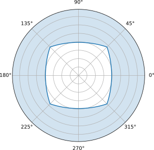

# skymask-py
Compute piecewise analytical solutions of skymask for given polyhedra.  
Provides efficient algorithms, parallel computing, and sampling methods.  
> Python binding of rust crate [skymask-rs](https://github.com/HellOwhatAs/Skymask-rs/).

## Benchmark
Runs on 11th Gen Intel(R) Core(TM) i7-11800H @ 2.30GHz (8 Physical Cores / 16 Logical Threads) and NVIDIA GeForce RTX 3070 Laptop GPU.
The benchmark code is available at [benchmark.py](https://github.com/HellOwhatAs/Skymask/blob/main/benchmark.py).

|Method|Fps|Time Complexity|
|-|-|-|
|Parallel sampling: `World.par_samples`|1648.87|$O((k \cdot n \log n + m) \cdot \log r)$|
|Sequential sampling: `SkymaskMap.samples`|176.05|$O((k \cdot n \log n + m) \cdot \log r)$|
|[Naive approach](https://github.com/HellOwhatAs/Skymask/blob/main/skymask.py) with Cupy|63.40|$O(m \cdot n)$|
|[Naive approach](https://github.com/HellOwhatAs/Skymask/blob/main/skymask.py) with Numpy|5.44|$O(m \cdot n)$|

> Where $n$ represents the number of line segments, and $k$ denotes the average number of segments each line overlaps with in the analytical result.
> $r$ denotes the number of segments in the analytical result, and $m$ refers to the number of discrete sample points taken from the skymask.  

## Install
Precompiled wheels at https://github.com/HellOwhatAs/skymask-py/releases.

## Example
```py
import skymask_py
import numpy as np
import matplotlib.pyplot as plt

lines = np.array([
    #  xa,   ya,   za,   xb,   yb,   zb
    [ 1.0,  1.0,  1.0, -1.0,  1.0,  1.0],
    [-1.0,  1.0,  1.0, -1.0, -1.0,  1.0],
    [-1.0, -1.0,  1.0,  1.0, -1.0,  1.0],
    [ 1.0, -1.0,  1.0,  1.0,  1.0,  1.0],
])
world = skymask_py.World.from_lines(lines, np.inf)
skymask = world.skymask((0, 0))
print("\n".join(
    f"pi/2-atan({a}*cos(t) + {b}*sin(t)) if t in [{s}, {e})"
    for (s, e), (a, b) in skymask.segments()
))

fig, ax = plt.subplots(subplot_kw={"projection": "polar"})
ax.yaxis.set_major_formatter("")
x = np.linspace(-np.pi, np.pi, num=500, endpoint=True)
x[-1] = x[0]
y = np.pi / 2 - skymask.samples(x)
ax.plot(x, y)
ax.fill_between(x, y, np.pi / 2, alpha=0.2)
ax.set_ylim(0, np.pi / 2)
plt.show()
```

<details open>
<summary>Outputs</summary>

```
pi/2-atan(-1.0*cos(t) + -0.0*sin(t)) if t in [-3.141592653589793, -2.356194490192345)
pi/2-atan(-0.0*cos(t) + -1.0*sin(t)) if t in [-2.356194490192345, -0.7853981633974483)
pi/2-atan(1.0*cos(t) + -0.0*sin(t)) if t in [-0.7853981633974483, 0.7853981633974483)
pi/2-atan(-0.0*cos(t) + 1.0*sin(t)) if t in [0.7853981633974483, 2.356194490192345) 
pi/2-atan(-1.0*cos(t) + -0.0*sin(t)) if t in [2.356194490192345, 3.141592653589793) 
```


</details>